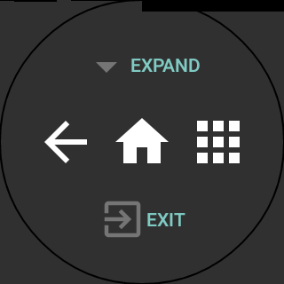

# Wearable Pad
*****
## Control Android phone/tablet from Wear
There are some apps to control your PC from Android Wear via Android phone/tablet.
However I couldn't find apps to control Android phone from Android wear.
This is just a challenge to do that.

[Movie on Youtube](https://youtu.be/_Xd0CTNc1C8)

[](https://play.google.com/store/apps/details?id=jp.tkgktyk.wearablepad)

## Solution
Android has Input SubSystem, /dev/input/eventX the same as Linux, processing user input from input devices including touch screen.
We can emulate user input by injecting input event to Input SubSystem, but normal user has no permissions and that is protected by SELinux.
Therefore we need **root permission** and **changing SELinux policy**.

### Changing SELinux policy
Use `setenforce` or `supolicy` command.
I referred to
[stackoverflow:Q27496968](http://stackoverflow.com/questions/27496968/inject-touch-screen-events-android-5-0-dev-input-eventx).
If the `supolicy` command is not available on your device, and you wish to automate changing of the SELinux policy use: [SELinuxModeChanger](https://f-droid.org/packages/com.mrbimc.selinux/) (requires root).

### Select touch screen from eventX
Android device has some /dev/input/eventX, X is number from 0, so you need to know which eventX links to your touch screen.
The number of touch screen is depending on device.
The following page is helpful for eventX:
[LMT Launcher's thread on XDA](http://forum.xda-developers.com/showthread.php?t=1330150)

For Nexus4, touch screen is /dev/input/event2, and Ratio X = 200%, and Ratio Y = 200%.

#### How to examine eventX of touch screen and Ratios

```
adb shell getevent -i
```

This command lists up /dev/input/eventX with details.
Touch screen device has `KEY (0001)` and `ABS (0003)` entries in `events` section.

And a row labeled 0035 in `ABS (0003)` describes x-axis of touch screen.
Range of x-axis is from `min` to `max`.
You get a value for Ratio X in Wearable Pad settings by dividing the `max` by pixels of width of your screen.
For Ratio Y, use `max` value in a row labeled 0036.

If cannot be divided as percent, round down to the nearest decimal percent.

## Pad UI
**IMPORTANT:**
Tap and longpress to exit Wearable Pad or perform extra actions.




### For v0.2.0 or later
|Phone/Tablet|Wear||
|---|---|---|
|Tap|Tap||
|Double Tap|Double Tap||
|Grab Mode|Triple Tap|Press without keeping on pressing Wear (From v0.2.1)|
|Taps (Up to 15)|Taps||
|Move Cursor|Swipe||
|Swipe|Tap + Swipe|Swipe after single tap|
|Tap + Swipe|Double Tap + Swipe|Zoom in/out by one finger|
|Taps + Swipe|Tap + Taps + Swipe|One more tap|
|Longpress|Long-Longpress|Keep pressing|

#### Feature
*   **Turn screen on automatically**

    Send wake up signal to handheld when start Wearable Pad.

*   **Grab mode**

    Longpress without keeping on pressing Wearable Pad until another tap event.
    You can move icon on homescreen and change area of text selection.

*   **Transfer mode (from v0.3.0)**

    Transfer touch event to another Android device.

    Wear ---> paired Phone (Transfer) ---> Tablet (Receiver)

### Before v0.2.0

|Phone/Tablet|Wear|
|---|---|
|Tap|Tap|
|Move Cursor|Swipe|
|Swipe|Longpress + Swipe|
|Tap + Swipe|Double Tap + Swipe|
|Taps + Swipe|Tap + Taps + Swipe|
|Longpress|Long-Longpress|

## Download
[Wearable Pad APKs](https://drive.google.com/folderview?id=0B3ROJmhB_rAyflRVUkkxOW1JWWdYdmtydXdzeEdjaUt0Q25vRC1RbFlmZjZnUVlSbDdaUWs&usp=sharing)
